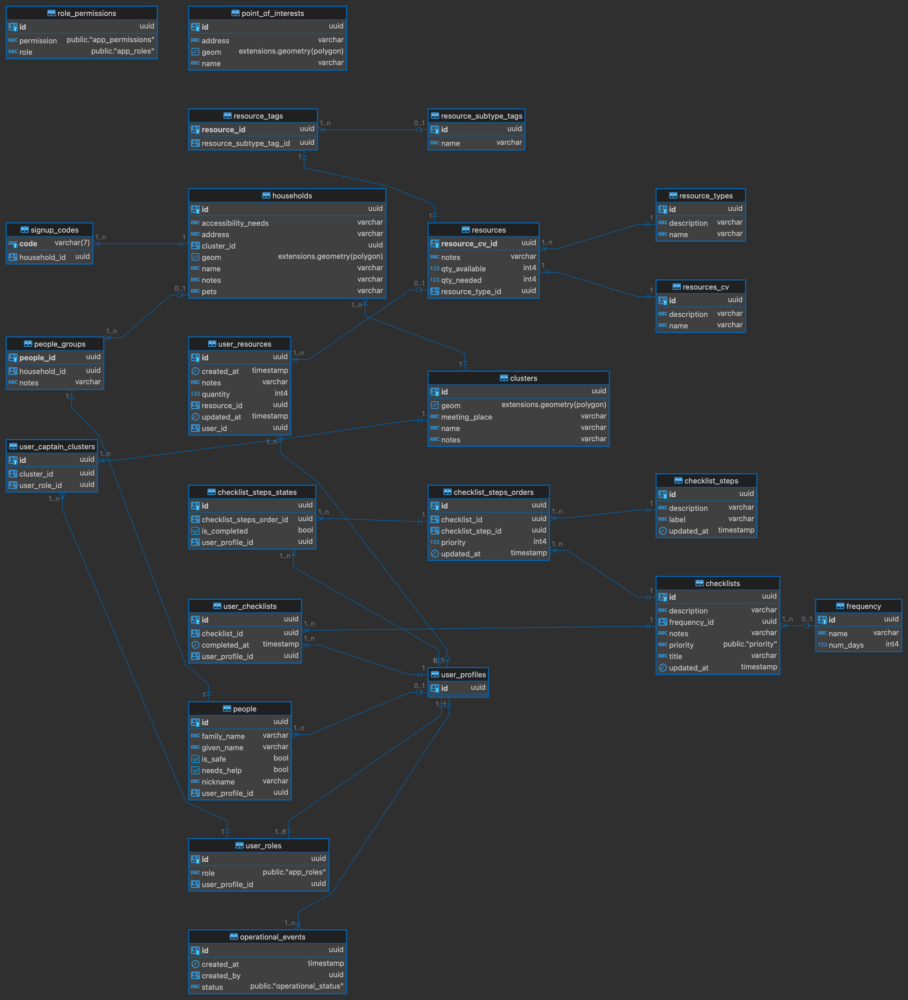

# Backend

## **Backend Technology Stack**

Supabase is an open source Firebase alternative. It is a service that provides a Postgres database with a RESTful API and real-time capabilities. It is used as the backend for the project.

For this project, we will be utilizing the community supabase kubernetes helm chart.
The helm chart can be found in [supabase-community/supabase-kubernetes](https://github.com/supabase-community/supabase-kubernetes).

Deploying supabase via Kubernetes allows for a cloud agnostic deployment as long as a Kubernetes cluster is available.

See [Official Documentation](https://supabase.com/docs)

## **Running locally**

To run this app locally, follow these steps:

0. Install Pixi: https://github.com/prefix-dev/pixi?tab=readme-ov-file#installation
1. In the package's directory, run the following to install `backend` tools

    ```console
    # install backend tools
    pixi run -e backend install-tools
    ```
2. Run the Docker daemon
3. Set up the infrastructure. You should have a Supabase instance running at http://localhost
    ```console
    pixi run -e backend setup-infra
    ```
    After the setup, when prompted to log in, enter your Supabase project credentials (Username and Password) for successful authentication. The credentials can be found in `deployment/values.dev.yaml`.
4. Optional: If you want to add sample entries in your local Supabase Instance. 
    Run the following command in a new terminal session.
    ```console
    pixi run -e backend setup-db-data-via-k8s-job
    ```

## Database diagram

Date generated: 11/25/2024


