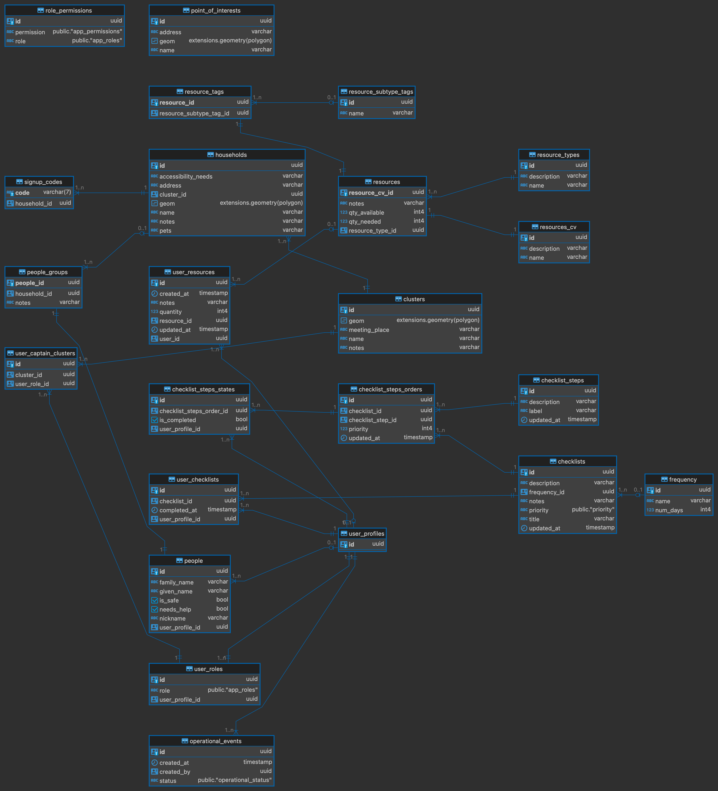

# Backend Components

For the backend infrastructure, the storage and API interfaces,
we utilize Supabase, an open source Firebase alternative. It is made up of many services on top of a Postgres database.


For deployment of Supabase, we utilized the community supabase kubernetes helm chart.
The helm chart can be found in [supabase-community/supabase-kubernetes](https://github.com/supabase-community/supabase-kubernetes). 
This helm chart allows for a cloud agnostic deployment as long as a Kubernetes cluster is available.
This ensures that the cloud deployment is exactly the same as the local deployment.

See [Official Supabase Documentation](https://supabase.com/docs) for more information about using supabase.

## Pixi

We use a tool called [Pixi](https://pixi.sh/latest/) to manage virtual environments and run tasks.
You can find the various task and environment definitions within the [`pixi.toml`](https://github.com/UW-THINKlab/resilience/blob/main/pixi.toml) file within the root directory of the repository.

Currently all of the backend tasks are defined in the `backend` environment.
The individual tasks are defined in either `backend` and `db` features.
This allows for a fine grained definitions for the feature dependencies.

Note that all dependencies defined in the `pixi.toml` file are retrieved
from the [`conda-forge` channel](https://prefix.dev/channels/conda-forge) in the conda repository.

For anything not installed directly from the channel, you can install it manually with a task. For example,
you see checkout the [`install-k3d` task](https://github.com/UW-THINKlab/resilience/blob/155d99912fdc9bb4b1b1533894153fee51f72c30/pixi.toml#L131-L134)
in the `backend` feature.

For more detailed information, we recommend reading the [Pixi Documentation](https://pixi.sh/latest/).

## Docker Images

The images used for each of the services are as follows:

- supabase/postgres
- supabase/studio
- supabase/gotrue
- postgrest/postgrest
- supabase/realtime
- supabase/postgres-meta
- supabase/storage-api
- darthsim/imgproxy
- kong
- supabase/logflare
- timberio/vector
- supabase/edge-runtime
- minio/minio

We've made a copy of these images within the `UW-ThinkLab`'s
Github Container Registry. This is to ensure that the images are
available in the event that the original images are removed,
or if we need to make changes to the images.

The github actions workflow for building
and pushing the images can be found in
[`.github/workflows/images.yaml`](https://github.com/UW-THINKlab/resilience/blob/main/.github/workflows/images.yaml)
and the images can be found in the [Resilience Container Registry](https://github.com/orgs/UW-THINKlab/packages?repo_name=resilience).

## Helm Chart

A Helm chart is a collection of files that define and package resources for a Kubernetes cluster as an application.
As mentioned earlier, we utilize the community supabase kubernetes helm chart for deployment of Supabase.
Currently we've set up a git submodule to the helm chart repository in the `vendors` directory.
You can simple fetch this submodule by running the following task with pixi:

```console
pixi run -e backend fetch-supabase-chart
```

Once you've fetched the submodule, you should now be able to see the full `supabase-kubernetes` repository in the `vendors` directory.

### Helm Chart Values

The deployment values for the helm chart can be found in
the yaml files found in the `deployment` directory.

The values are separated into two files:
* `values.dev.yaml`: This is the values file for the development environment.
You can use this file to deploy the backend services to a local kubernetes cluster.
It does contains unencrypted secrets and should not be used in production.
* `values.cloud.yaml`: This is the values file for the production environment.
You can use this file to deploy the backend services to a production kubernetes cluster,
whether it be on the cloud or on-premises.
It contains encrypted secrets and can be used in production. 
    
    
    **Editing values.cloud.yaml (Optional)**

    The `values.cloud.yaml` has been encrypted using a tool called [SOPS: Secrets OPerationS](https://github.com/getsops/sops).
    This allows us to fully encrypt the secrets in the file and only decrypt them when we need to edit or use them.

    To open the file with VSCode, run the following first

    ```
    export EDITOR="code --wait"
    ```

    Then run the following. Save and close the file when you're done editing for all of your new values to be re-encrypted.

    ```
    pixi run edit-cloud-values
    ```

    If you run into an issue like `gpg: decryption failed: Inappropriate ioctl for device`, run the following command and retry

    ```
    export GPG_TTY=$(tty)
    ```

## Python package

Since the underlying database for Supabase is Postgres,
we are able to utilize Object Relational Mapping (ORM) to define the database schema.

We use the `sqlmodel` package to define the database schema. [SQLModel](https://sqlmodel.tiangolo.com/) is a library that combines the power of [SQLAlchemy](https://www.sqlalchemy.org/) and [Pydantic](https://docs.pydantic.dev/latest/).

The python package that defines the database schema can be found in the [`src/support_sphere_py`](https://github.com/UW-THINKlab/resilience/tree/main/src/support_sphere_py) directory.

The package is structured as follows:

```console
.
├── src
│   └── support_sphere
│       ├── apis
│       ├── models
│       │   ├── auth
│       │   ├── enums
│       │   └── public
│       ├── repositories
│       │   ├── auth
│       │   └── public
│       ├── scripts
│       │   └── resources
│       │       └── data
│       └── services
└── tests
```

**`src/support_sphere`**:

- `models`: This directory contains the ORM models for the database, and is further divided into subdirectories for each schema.
- `repositories`: This directory contains the repository classes for the models, which allows for CRUD operations.
- `scripts`: This directory contains scripts for direct database operations, such as loading data.
- `services`: This directory contains any services that need to interact with the database.
    - `resources/data`: This directory contains any data files to be loaded into the database.
- `apis`: This directory contains the API directory for fastapi routes (not implemented).

**`tests`**: This directory contains any tests for the package.

## **Running locally**

To run this app locally, follow these steps:

0. Install [Pixi](https://github.com/prefix-dev/pixi?tab=readme-ov-file#installation)
1. In the package's directory, run the following to install `backend` tools

    ```console
    # install backend tools
    pixi run -e backend install-tools
    ```
2. Run the Docker daemon
3. Set up the infrastructure. You should have a Supabase instance running at http://localhost
    ```console
    pixi run -e backend setup-infra
    ```
    After the setup, when prompted to log in, enter your Supabase project credentials (Username and Password) for successful authentication. The credentials can be found in `deployment/values.dev.yaml`.
4. Optional: If you want to add sample entries in your local Supabase Instance. 
    Run the following command in a new terminal session.
    ```console
    pixi run -e backend setup-db-data-via-k8s-job
    ```

## Database diagram

Date generated: 11/25/2024



